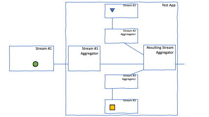

# conway-life-stream-reactor-client

## Overview
A basic stream aggregator that is built with help of [Reactor Project](https://projectreactor.io/) (a fourth-generation reactive library, based on the Reactive Streams
specification, for building non-blocking applications on the JVM).

This application is developed to be deployed in Kubernetes cluster, listen to the stream from other similar service
[conway-life-stream-server](https://github.com/fedor-malyshkin/conway-life-stream-server) (deployed in the same cluster) and aggregates
results with 2 internal streams and eventually publish the resulting aggregated stream through the single HTTP endpoint.

An oversimplified version of stream can be illustrated there:



## Article
* [Manage data streams with Reactor Project](https://medium.com/@fedor-malyshkin/manage-data-streams-with-reactor-project)

## Used technologies
* [Reactor library](https://projectreactor.io/)
* [Spring WebFlux](https://spring.io/reactive)
* Java 15
* [Java records](https://openjdk.java.net/jeps/359) 
* [GitHub Container Registry](https://github.com/fedor-malyshkin?tab=packages) - a new Docker image repo from GitHub

### Reference documentation:
* [Reactor library](https://projectreactor.io/docs/core/release/reference/#which.create)
* [Spring WebFlux](https://docs.spring.io/spring-framework/docs/current/reference/html/web-reactive.html)

## Requirements
* JDK 15

## Client
TBD

## Compilation and run
As a build tool I use [gradle](https://gradle.org/) and `gradle-wrapper`, so you can easily compile and build
application with `./gradlew build` and run with `./gradlew run`.

## CI/CD
For integration and deployment was used GitHub's framework - GitHub Actions. Workflow source is available [there](.github/workflows/ci-cd.yml)
Active workflow could be found [there](https://github.com/fedor-malyshkin/conway-life-stream-reactor-client/actions).

## Deployment
For deployment Kubernetes cluster was used. Deployment descriptors are available in `deployment` sub-folder.

### How to create Docker image manually
```shell
./gradlew build
docker build -t ghcr.io/fedor-malyshkin/conway-life-stream-reactor-client:latest -f docker/Dockerfile build/libs
```

### How to push to GitHub Container Registry manually
```shell
export CR_PAT=YOUR_TOKEN
echo $CR_PAT | docker login ghcr.io -u fedor-malyshkin --password-stdin
docker push ghcr.io/fedor-malyshkin/conway-life-stream-reactor-client:latest
```

### Kubernetes deployment:
The initial deployment is done by the commands (in `deployment` sub-folder):
```sh
kubectl apply -f stream-reactor-client-deployment.yml
kubectl apply -f stream-reactor-client-service.yml
kubectl apply -f stream-reactor-client-loadbalancer.yml
```

The assigned IP can be found with the command:
```sh
kubectl describe service/stream-server-loadbalancer | egrep Ingress
```

Whereas the correctness of work with the command:
```sh
curl http://<IP>/health
```

## Some technicalities
### Enable netty access to unsafe operations

As netty intensively uses some unsafe JVM features - they should be open by the set of special commands.
Add such keys to your java app and don't forget to use them in your IDE during test (Dockerfile is updated for it)

```ssh
--add-opens java.base/jdk.internal.misc=ALL-UNNAMED
-Dio.netty.tryReflectionSetAccessible=true
--illegal-access=warn
```

### netty's epool library

Don't forget to attach native JNI library that add features specific to a particular platform,
generate less garbage, and generally improve performance when compared to the NIO based transport.

Gradle:
```dtd
implementation "io.netty:netty-transport-native-epoll:${EPOLL_NATIVE_VER}:linux-x86_64"
```

### use of record and their serialization
It requires pay a close attention to version of serializer you use as support for java records has been added 
recently enough.

### Output format
```json
{
  "conwayCountOfAlive": 261,
  "conwayCountOfDead": 4739,
  "engVowelsStat": {
    "mean": 1.6,
    "variance": 0.46315789473684216,
    "standardDeviation": 0.6805570473787206,
    "max": 3.0,
    "min": 1.0,
    "n": 20,
    "sum": 32.0
  },
  "engConsonantsStat": {
    "mean": 2.0,
    "variance": 0.9473684210526315,
    "standardDeviation": 0.9733285267845752,
    "max": 5.0,
    "min": 1.0,
    "n": 20,
    "sum": 40.0
  },
  "engLengthStat": {
    "mean": 3.6,
    "variance": 2.0421052631578944,
    "standardDeviation": 1.429022485182754,
    "max": 8.0,
    "min": 2.0,
    "n": 20,
    "sum": 72.0
  },
  "engCountOfWords": 20,
  "rusVowelsStat": {
    "mean": 2.05,
    "variance": 1.628947368421053,
    "standardDeviation": 1.2763022245616642,
    "max": 5.0,
    "min": 0.0,
    "n": 20,
    "sum": 41.0
  },
  "rusConsonantsStat": {
    "mean": 3.75,
    "variance": 4.197368421052632,
    "standardDeviation": 2.0487480130686233,
    "max": 7.0,
    "min": 0.0,
    "n": 20,
    "sum": 75.0
  },
  "rusLengthStat": {
    "mean": 5.8,
    "variance": 9.43157894736842,
    "standardDeviation": 3.071087583799658,
    "max": 10.0,
    "min": 1.0,
    "n": 20,
    "sum": 116.0
  },
  "rusCountOfWords": 20,
  "mills": 1610570220753
}
```